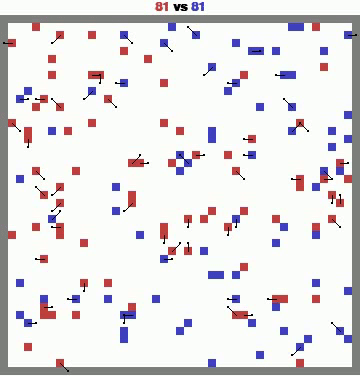
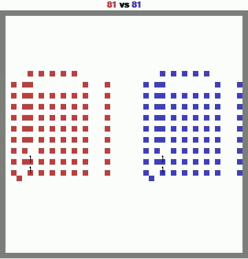

# MAgent2 - RL Final Project


## Problem

This is the final project for the course AIT-3007 - Reinforcement Learning and Scheduling. The assignment given to us is as follows:

```
In this final project, you will develop and train a reinforcement learning (RL) agent using the MAgent2 platform. The task is to solve a specified MAgent2 environment `battle`, and your trained agent will be evaluated on all following three types of opponents:

1. Random Agents: Agents that take random actions in the environment.
2. A Pretrained Agent: A pretrained agent provided in the repository
3. A Final Agent: A stronger pretrained agent, which will be released in the final week of the course before the deadline

Your agent's performance should be evaluated based on reward and win rate against each of these models. You should control *blue* agents when evaluating.
```
<p align="center">
  
  
  
</p>


## Our methods
To address the problem, we implemented and experimented with the following three algorithms:

1. **Double Deep Q Learning** : We experimented with training using random and self-play (**the best results**). Since each agent observes only a matrix of size (13x13x5), we used a single Q-network that learns from the data of both the red and blue agents. Results showed that the algorithm converges quite quickly; after 70 training episodes, it was able to completely defeat the three agents used for evaluation. Furthermore, the training results for random and self-play were nearly identical. 

2. **QMix**: We experimented with training using a random agent. Results showed that the algorithm did not perform well and failed to improve after 30 episodes. We used a single Q_a network to learn for all agents, based on data from both the blue and red agents. Additionally, we experimented with grouping agents into 9, 27, and 81 clusters instead of using the entire observation space of 81 agents for the QMix network. However, the algorithm's results remained poor and showed no improvement.

3. **VDN**: Similar to the QMix algorithm, but we experimented with 81 different Q-networks sharing the same architecture, training only with random agents. Like QMix, the algorithm performed poorly and failed to improve.


In all experiments (my agent was trained as blue), we used 70 training episodes with an epsilon decay of 0.04 (initial value of 1, minimum value of 0.01). The batch size was fixed at 64, the environment was configured with an $attack\_opponent\_reward$ of 0.5, the buffer capacity was set to 10,000, the learning rate was 1e-3, and gamma was 0.6 (Check this [doc](Report_AI3007.pdf) for detail)

## Results

During the training process, we logged several metrics to evaluate the effectiveness of each method (details provided [at](https://wandb.ai/trungviet17/RL_TRAINING/reports/RL-Report---VmlldzoxMDY4NzA4Ng)):

<p align="center"> 
   
</p>

From the results, the Double Q-Learning algorithm proved to be significantly more effective than the other two methods. We also experimented with this algorithm under three settings: using a network with the same architecture as the published pretrained model, a custom-designed network, and self-play. The results were nearly identical across all settings. Below are some experimental results when our trained agent was tested against 3 agents used for evaluation

1. The DDQN Agents ([checkpoint](model/state_dict/my_random5.pt)) trained with Random achieved the following results against Random, Pretrained Agent, and Final Agent (results shown from left to right): 


<p align="center">
  
  
  
</p>

2. The DDQN Agents ([checkpoint](model/state_dict/self_play.pt)) trained using self-play achieved the following results against Random, Pretrained Agent, and Final Agent (results shown from left to right): 

<p align="center">
  
  
  
</p>

We ran the provided eval.py script using the DDQN Agents trained with Random, and obtained the following results:

<p align="center"> 
   
</p>


## How to Run
First, you should clone this repo and install with or you only need to download notebook [at](notebooks/rl-final-project.ipynb) and run all cells. 
```
pip install -r requirements.txt
```

Secondly, if you want to retrain the Double Deep Q results for both random and self-play, use the following command:

```
python main.py -mode=<self-play or random> -save_dir=<path to save model cpt>
```

If you want to run the evaluation code using our pre-trained model checkpoints, execute the following command (we provide pre-trained models for [random](model/state_dict/my_random.pt) and [self-play](model/state_dict/self_play.pt) ): 
```
python eval.py -model_path=<path to model>
```

If you want to view demo videos of matches between agents, run the following command:
```
python main.py -blue_agent=<blue name> -red_agent=<red_name> -save_path=<path to save video>
```


## Project Structure 


```
MAgent2 RL Final Project
├── utils 
│   └── memory.py        # memory model containt replay buffer and statememory
├── agent               # implement agents
│   ├── DQl_agent.py
│   ├── QMix_agent.py
│   └── base_agent.py
├── assets              
│   ├── doc
│   └── video           
├── notebooks 
│   ├── rl-training.ipynb     # training and eval with notebook 
│   └── VDN.ipynb
├── main.py           # run inference 
├── model               # implement Q networks
│   ├── networks.py 
│   └── state_dict      # save checkpoint 
├── README.md 
├── requirements.txt
├── train.py       # Training 
├── Report.pdf    
└── eval.py       # eval with 3 model 
```


## Members 

<table>
<tr>
  <td  valign="top" width="14.28%"><a href="https://github.com/trungviet17"><br /><sub><b>Nguyễn Ngô Việt Trung</b></sub></a><br/></td>
  <td  valign="top" width="14.28%"><a href="https://github.com/TienVM2004"><br /><sub><b>Vũ Minh Tiến </b></sub></a><br/></td>
  <td  valign="top" width="14.28%"><a href="https://github.com/VinhPhamAI"><br /><sub><b>Phạm Quang Vinh</b></sub></a><br/></td>
</tr>
</table>


## References

1. [MAgent2 GitHub Repository](https://github.com/Farama-Foundation/MAgent2)
2. [MAgent2 API Documentation](https://magent2.farama.org/introduction/basic_usage/)
